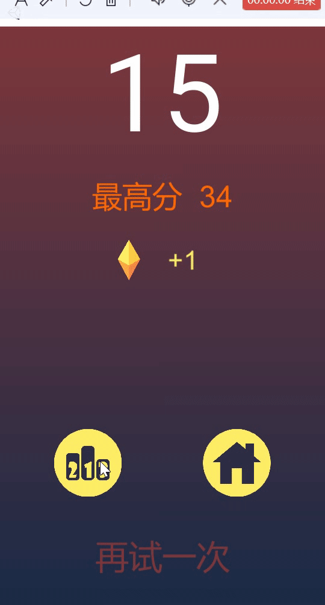
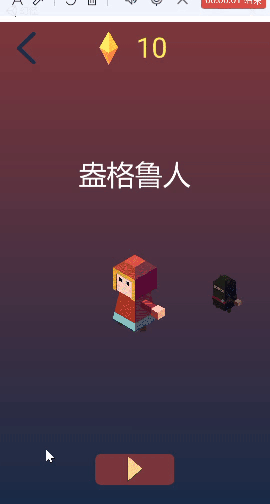
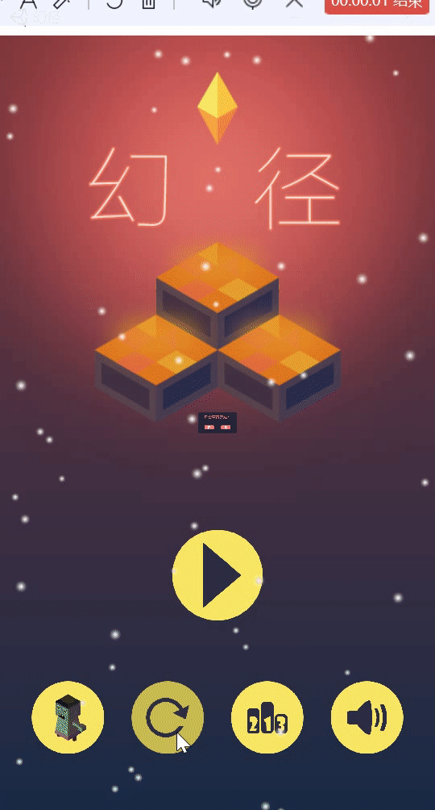

# Dreamland

[TOC]


## 1. Description

### 1.1 Overview

We use **Unity3D** to develop a 3D interactive system called ***Dreamland*** as our final *Human-Computer Interaction* course project. 

**Unity** is a real-time 3D interactive content creation and operation platform that provides a comprehensive set of software solutions for creating 3D content that can be interacted with in real time.

**Dreamland** is a 3D casual puzzle game. Players can experience the natural gameplay in the game through the simple and fresh painting style. Players need to challenge the steps jumping quickly. In the endless mode, the number of steps and time are infinite, and players can go all the way without mistakes and set off a super storm.

### 1.2 Structure and Modules

We design five kinds of  panel for our project, which are **MainPanel**, **GamePanel**, **GameOverPanel**, **ShopPanel**, **ResetPanel**, **RankPanel**. These panels have corresponding **C# Scripts** for them to realize the interaction.

#### 1.2.1 MainPanel

When our user starts our program, he will first see this panel and can **click** on ▶ to start the game.

**Click** on the 🔈 to turn on or off the game's music and sound effects.


#### 1.2.2 GamePanel

In this panel, user can **use the mouse or keyboard** to control the character to jump steps in different directions,  and the game scene and steps are <u>randomly generated.</u>


#### 1.2.3 GameOverPanel

After the game is over jump to this panel, in which the player can **check** **the score and the number of bonus coins** of this game.

Also, the player can choose to **view the current ranking**, jump to the `MainPanel` or try again.


#### 1.2.4 ShopPanel

Click the character button in the <u>`MainPanel`</u> to enter the <u>`ShopPanel`</u>, in which players can **drag left and right to view** different characters, and can use the coins gained to buy characters. **Click** the button below the existing character to select that character.


#### 1.2.5 ResetPanel

**Click** 🔄 at the bottom in <u>`MainPanel`</u> to reset the game, i.e. clear the cached ranking data.


#### 1.2.6 RankPanel

**Click** the ranking button at the bottom of the <u>`MainPanel`</u> to see the top three game scores for the current game cache.


## 2. Implemented Requirements

### 2.1 Interaction in MainPanel


**Four option buttons and a Game Start button** are in the `MainPanel`:

* **Click** on the role button to <u>access the `ShopPanel`</u>, as described below, where users can purchase and select roles in the scenario.
* **Clicking** on the reset button, a dialogue window will pop up <u>asking the player whether or not to reset</u> the game, and the corresponding action will be taken according to the player's choice.
* **Clicking** the ranking button will bring up <u>the top three scores</u> of the current game.

### 2.2 Interaction in GamePanel


In the `GamePanel`, the player can control the character with <u>the mouse or keyboard.</u>

* **Mouse** ：
  * **Click the left mouse** button to control the character to jump a step to the left.
  * **Click the right mouse** button to control the character to jump a step to the right.
* **Keyboard**：
  * **Click the keyboard⬅** button to control the character to jump a step to the left.
  * **Click the keyboard ➡** button to control the character to jump a step to the right.

The game is endless mode, in which the player can control the character to continuously jump on the steps, until the character fails to jump on the next higher step or jump on the steps with obstacles before the steps fall, which indicates the game is over.

### 2.3 Interaction in GameOverPanel


If the player's operation inadvertently causes the game to end, it will enter <u>`GameOverPanel`</u>.

* **Information**:

  This panel will show the number of points the player has scored in this round, and the number of rewards earned. If this score is the current maximum score, the word "最高分" will also be displayed.

* **Button**:

  There are three options available in this screen.

  * **RankPanel** button: Click on the RankPanel button , it will enter the `RankPanel`, where players can view the top three scores of the current game.
  * **MainPanel** button: click on the MainPanel button at the bottom, it will enter the `MainPanel`.
  * **TryAgain** button: Click on the bottom "再试一次" to restart a new round of the game.

### 2.4 Interaction in ShopPanel


In this panel, players can hold down the left mouse button and drag the screen to view the different characters.

* For roles **already owned**

  Players can click the button at the bottom of the panel to <u>select the character to play.</u>

* For roles **not yet owned**

  The buy button at the bottom of the screen shows the amount of coins needed to <u>buy the character</u>. If the player currently has enough coins, he can click the buy button to buy the character.

### 2.5 Interaction in ResetPanel


When the player clicks the Reset button in the `MainPanel`, a dialog box will pop up asking the player if he/she confirms to reset the game, and providing "No" and "Yes" buttons.

* **Click** "No" to <u>close the dialog box</u>.
* **Click** "Yes" to <u>reset</u> the game and <u>clear</u> the current game ranking data.

### 2.6 Interaction in RankPanel


**Clicking** on the ranking button in the panel will bring up an information box showing <u>the top three game scores</u> for the current ranking.

**Click** anywhere on the panel again to <u>close the message box.</u>


## 3. Advantages and Disadvantages

### 3.1 Advantages

1. The biggest advantage of our project is that its **interface and UI is fascinating**. We apply some interesting models and randomly generated scenes to make the game look more interesting and attractive.
2. The structure of our program is **concise and organized**, so it is very easy for us to make some improvement.
3. our main interaction **logic is unified,** allowing users to understand and master the functions that can be realized simply and clearly.
4. **The event distribution mechanism** is used to uncouple, making it easier to control events and add subsequent improvements.
5. The game is **simple to operate** and the **interaction is clear and straightforward**.

### 3.2 Disadvantages

1. The game mode is <u>relatively single,</u> currently only has endless mode.

   More complex modes can be added to this, such as a time-limited mode, which counts how many steps the player can control the character to jump over within a certain period of time.

2. The game scene is <u>not beautiful enough.</u>

   Some suitable plot for the game can be added, corresponding to the plot design of different scenes, showing a more colorful and moving visual effects.

3. Our games <u>cannot be adapted for screen resolution</u> and we have n<u>ot been able to port the games to other platforms other than Windows.</u>

4. The <u>game difficulty is relatively simple,</u> players can not choose their own control to adjust the difficulty of the game.

##  4. How to Improve

According to the analysis of our advantages and disadvantages, there are many things we can do to improve our program:

1. We can make full use of the Unity3D engine to **add more features**.
2. It is convenient for us to **port Unity3D to other platforms**, so we could try this after we finish our projects. 
3. Develop **more game modes** on the basis of the current game, as well as develop **the game difficulty adjustment mechanism.**

## 5. Development Environment

- **Development Environment:** 

  Win 10 

- **Development Software:**

  1. **Unity3D** 2020.3.21
  2. **Visual Studio 2019** *15.9.28307.665*

- **Development Language:**

  ​	C#

  


## 6. Game Logic

We have write many scripts which you can see in the *Script* folder of our project. But I only show some of the core scripts here.
### 6.1 EventListener
`EventCenter.cs`

```c#
public class EventCenter
{
    private static Dictionary<EventDefine, Delegate> m_EventTable = new Dictionary<EventDefine, Delegate>();

    private static void OnListenerAdding(EventDefine eventType, Delegate callBack)
    {
        if (!m_EventTable.ContainsKey(eventType))
        {
            m_EventTable.Add(eventType, null);
        }
        Delegate d = m_EventTable[eventType];
        if (d != null && d.GetType() != callBack.GetType())
        {
            throw new Exception(string.Format("尝试为事件{0}添加不同类型的委托，当前事件所对应的委托是{1}，要添加的委托类型为{2}", eventType, d.GetType(), callBack.GetType()));
        }
    }
    //no parameters
    public static void AddListener(EventDefine eventType, CallBack callBack)
    {
        OnListenerAdding(eventType, callBack);
        m_EventTable[eventType] = (CallBack)m_EventTable[eventType] + callBack;
    }
```

### 6.1 Spawn Random Platforms

`PlatformSpawner.cs`

```c#
private void SpawnPlatform()
{
    int ranObstacleDir = Random.Range(0, 2);
    //生成单个平台
    if (spawnPlatformCount >= 1)
    {
        SpawnNormalPlatform(ranObstacleDir);
    }
    //生成组合平台
    else if (spawnPlatformCount == 0)
    {
        int ran = Random.Range(0, 3);
        //生成通用组合平台
        if (ran == 0)
        {
            SpawnCommonPlatformGroup(ranObstacleDir);
        }
        //生成主题组合平台
        else if (ran == 1)
        {
            switch (groupType)
            {
                case PlatformGroupType.Grass:
                    SpawnGrassPlatformGroup(ranObstacleDir);
                    break;
                case PlatformGroupType.Winter:
                    SpawnWinterPlatformGroup(ranObstacleDir);
                    break;
                default:
                    break;
            }
        }
        //生成钉子组合平台
        else
        {
            int value = -1;
            if (isLeftSpawn)
            {
                value = 0;//生成右边方向得钉子
            }
            else
            {
                value = 1;//生成左边方向得钉子
            }
            SpawnSpikePlatform(value);

            isSpawnSpike = true;
            afterSpawnSpikeSpawnCount = 4;
            if (spikeSpawnLeft)//钉子在左边
            {
                spikeDirPlatformPos = new Vector3(platformSpawnPosition.x - 1.65f,
                    platformSpawnPosition.y + vars.nextYPos, 0);
            }
            else
            {
                spikeDirPlatformPos = new Vector3(platformSpawnPosition.x + 1.65f,
                    platformSpawnPosition.y + vars.nextYPos, 0);
            }
        }
    }

    int ranSpawnDiamond = Random.Range(0, 8);
    if (ranSpawnDiamond >= 6 && GameManager.Instance.PlayerIsMove)
    {
        GameObject go = ObjectPool.Instance.GetDiamond();
        go.transform.position = new Vector3(platformSpawnPosition.x,
            platformSpawnPosition.y + 0.5f, 0);
        go.SetActive(true);
    }
    if (isLeftSpawn)//向左生成
    {
        platformSpawnPosition = new Vector3(platformSpawnPosition.x - vars.nextXPos,
            platformSpawnPosition.y + vars.nextYPos, 0);
    }
    else//向右生成
    {
        platformSpawnPosition = new Vector3(platformSpawnPosition.x + vars.nextXPos,
            platformSpawnPosition.y + vars.nextYPos, 0);
    }
}
```

### 6.2 Control the Player

PlayerController.cs

```c#
private void Jump()
    {
        if (isJumping)
        {
            if (isMoveLeft)
            {
                transform.localScale = new Vector3(-1, 1, 1);
                transform.DOMoveX(nextPlatformLeft.x, 0.2f);
                transform.DOMoveY(nextPlatformLeft.y + 0.8f, 0.15f);
            }
            else
            {
                transform.DOMoveX(nextPlatformRight.x, 0.2f);
                transform.DOMoveY(nextPlatformRight.y + 0.8f, 0.15f);
                transform.localScale = Vector3.one;
            }
        }
    }
```

### 6.3 Camera Follow

`CameraFollow.cs`

```c#
private void Update()
    {
        if (target == null && GameObject.FindGameObjectWithTag("Player") != null)
        {
            target = GameObject.FindGameObjectWithTag("Player").transform;
            offset = target.position - transform.position;
        }
    }
    private void FixedUpdate()
    {
        if (target != null)
        {
            float posX = Mathf.SmoothDamp(transform.position.x,
                target.position.x - offset.x, ref velocity.x, 0.05f);
            float posY = Mathf.SmoothDamp(transform.position.y,
               target.position.y - offset.y, ref velocity.y, 0.05f);

            if (posY > transform.position.y)
                transform.position = new Vector3(posX, posY, transform.position.z);
        }
    }
```

### 6.4 Shop

`ShopPanel.cs`

```c#
private void OnBuyButtonClick()
    {
        EventCenter.Broadcast(EventDefine.PlayClikAudio);
        int price = int.Parse(btn_Buy.GetComponentInChildren<Text>().text);
        if (price > GameManager.Instance.GetAllDiamond())
        {
            EventCenter.Broadcast(EventDefine.Hint, "钻石不足");
            Debug.Log("钻石不足，不能购买");
            return;
        }
        GameManager.Instance.UpdateAllDiamond(-price);
        GameManager.Instance.SetSkinUnloacked(selectIndex);
        parent.GetChild(selectIndex).GetChild(0).GetComponent<Image>().color = Color.white;
    }
```

### 6.5 Rank
`RankPanel.cs`

```c#
private void Show()
    {
        gameObject.SetActive(true);
        btn_Close.GetComponent<Image>().DOColor(new Color(btn_Close.GetComponent<Image>().
            color.r, btn_Close.GetComponent<Image>().color.g,
            btn_Close.GetComponent<Image>().color.b, 0.3f), 0.3f);
        go_ScoreList.transform.DOScale(Vector3.one, 0.3f);

        int[] arr = GameManager.Instance.GetScoreArr();
        for (int i = 0; i < arr.Length; i++)
        {
            txt_Scores[i].text = arr[i].ToString();
        }
    }

```

### 6.6 Music and Audio
`ClickAudio.cs`

```c#
using System.Collections;
using System.Collections.Generic;
using UnityEngine;

public class ClickAudio : MonoBehaviour
{
    private AudioSource m_AudioSource;
    private ManagerVars vars;

    private void Awake()
    {
        m_AudioSource = GetComponent<AudioSource>();
        vars = ManagerVars.GetManagerVars();
        EventCenter.AddListener(EventDefine.PlayClikAudio, PlayAudio);
        EventCenter.AddListener<bool>(EventDefine.IsMusicOn, IsMusicOn);
    }
    private void OnDestroy()
    {
        EventCenter.RemoveListener(EventDefine.PlayClikAudio, PlayAudio);
        EventCenter.RemoveListener<bool>(EventDefine.IsMusicOn, IsMusicOn);
    }
    private void PlayAudio()
    {
        m_AudioSource.PlayOneShot(vars.buttonClip);
    }
    /// <summary>
    /// 音效是否开启
    /// </summary>
    /// <param name="value"></param>
    private void IsMusicOn(bool value)
    {
        m_AudioSource.mute = !value;
    }
}

```


## 7.Preview

### GamePanel


### GameOverPanel



### ShopPanel




### ResetPanel



## 8.About the author

### adviser

* Ying Shen

### Authors

| ID      | Name                |
| ------- | ------------------- |
|  | 吴杨婉婷     |
| |陈中悦     |
|  |肖杨 |


