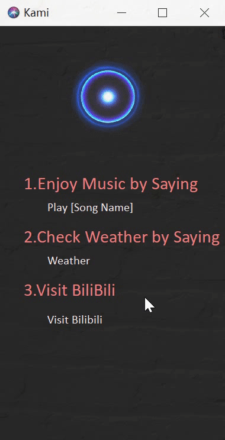

[toc]

## Lab1: Automatic Speech Recognition

###### 简易语音助手----Kami


### 项目简介

基于`PocketSphinx`的英文版简易语音助手——Kami

联网状态下可实现播放音乐/天气预报/网站访问功能.

### 功能介绍

1. "**Kami**" <u>*唤醒语音助手*</u>

2. 起始页面**双击窗口**查看 <u>*使用说明*</u>

3. 唤醒Kami后：

   1. "**play [song name]**"  <u>*网易云音乐播放[song name]*</u> 

      <!--(若安装有chrome浏览器以及对应版本的chromedriver)-->

      "**play**"  <u>*播放音乐creep*</u>

   2. "**weather** " <u>*上海近两日天气*</u>

   3. "**visit bilibili**" <u>*访问"bilibili"*</u>

4. 退出语音助手

### 开发环境

​	**PyCharm** *2020.1.3  PC-201.8538.36*

> 引用模块
>
> > SpeechRecognition
> >
> > PocketSphinx
> >
> > PyAudio
> >
> > PyQt5
> >
> > selenium
> >
> > requests
> >
> > beautifulsoup4

### 项目结构

```
│  Kami.py
│  README.md
│  report.md
│  requirements.txt
│
├─display
│      初始.gif
│      在线播放.png
│      天气预报.png
│      失败激活.gif
│      成功激活.gif
│      本地播放.png
│      访问网站.png
│      说明.gif
│
├─resource
│  ├─icon
│  │      siri.gif
│  │      siri.png
│  │      voice.gif
│  │
│  └─music
│          Creep-Damien Rice .mp3
│
└─src
        KamiInterface.py
        MusicInterface.py
        WeatherInteface.py
```


### 功能实现

1. #### 语音识别

   通过麦克风获取用户语音指令，无法检测到声音时自动停止。并使用recognize_sphinx()识别用户的指令。

   ```python
   def _recog(self):
       mic = sr.Microphone()
       with mic as source:
           r.adjust_for_ambient_noise(source)
           audio = r.listen(source)
           return audio
           
   com=r.recognize_sphinx(audio) #识别出用户语音命令
   ```

2. #### 唤醒Kami

   调用`difflib`模块进行字符串相似度匹配。

   * 起始页面：用户指令com与"Kami"进行相似度匹配：
     * 相似度>0.1，唤醒成功：调用self.successAwake()，提示用户语音输入指令，识别并执行对应的功能
     * 相似度<0.1，唤醒失败：调用self.failAwake()，提示用户唤醒失败

   ```python
   import difflib
   
   # 检测s1和s2的相似度
   def similar(s1,s2):
       return difflib.SequenceMatcher(None, s1, s2).quick_ratio()
   
   # 主页面唤醒过程相似度匹配核心代码
   s=similar(com,"Kami")
   print("similar: {}".format(s))
   if self.inNote==False and s>0.1: # 激活成功
   	self.successAwake()
   else: # 激活失败
       self.failAwake()
       
   ```

3. #### 功能识别

   调用`difflib`模块进行字符串相似度匹配。

   * 唤醒页面：用户指令前四字母keyWord分别与"paly", "chec","visi" 进行相似度匹配：
     * 相似度列表 最大相似度值<0.2，无法识别用户指令，随机执行一条功能
     * 相似度列表 最大相似度值>0.2,  执行改相似度最高的功能

   ```python
   import difflib
   
   # 检测s1和s2的相似度
   def similar(s1,s2):
       return difflib.SequenceMatcher(None, s1, s2).quick_ratio()
   
   # 唤醒页面功能执行过程相似度匹配核心代码
   keyWord=com[:4] # 检查命令的前四个字母
   proCom=[similar(keyWord,"play"), 		similar(keyWord,"chec"),similar(keyWord,"visi")]
   maxPro=max(proCom)
   
   index=0
   if maxPro<0.2:
       print("I guess you want to ...")
       index=random.randint(1,3)
   else:
       index=proCom.index(maxPro)+1
   ```

4. #### 查看说明

   * 初始页面双击窗体进入说明页面，查看语音助手功能说明
   * 说明页面双击窗体返回主页面，基于执行唤醒识别过程
   * 唤醒语音助手后双击窗口无法进入说明页面

   ```python
   # 鼠标双机窗体跳转说明页面核心代码
   def mouseDoubleClickEvent(self,event):
       # 激活状态点击无效
       if self.isAct==True:
           return
   
       self.helloLabel.setVisible(self.inNote)
       self.noteLabel.setVisible(self.inNote)
   
       if self.inNote==True:# 若原本在说明页面，返回主页面
           self.inNote=False
       else: # 进入说明页面
           self.inNote=True
   ```

5. #### 持续识别

   * 调用 threading.Timer(), timer.start(), timer.cancel()控制使用定时器
   * 主页面定时2.1s执行一次语音识别功能

   ```python
   import threading
   
   global timer
   timer = threading.Timer(2.1, self.siriRecog) 
   timer.start()
   
   timer.cancel()
   ```

6. #### 播放音乐

   * 若用户本地已安装chrome浏览器及对应版本的chromedriver，调用自定义音乐播放模块`MusicInterface`浏览器页面打开网易云音乐并自动搜索、播放用户语音输入音乐
   * 若用户本地未安装所需浏览器或驱动器，自动播放资源文件夹中的音乐"creep"

   ```python
   # 播放本地音乐功能
   os.startfile(r"resource\music\Creep-Damien Rice .mp3")
   
   # 自定义音乐播放接口模块 MusicInterface.py
   class PlayMusic():
       def __init__(self, songName, driverPath):
           self.songName=songName
           self.chromeDriverPath=driverPath
   
       def play(self):
           chrome_driver = os.path.abspath(self.chromeDriverPath)
           print(chrome_driver)
           options = webdriver.ChromeOptions()
           options.add_experimental_option('excludeSwitches', ['enable-logging'])
           chrome = webdriver.Chrome(executable_path=chrome_driver,options=options)
   
           url = "https://music.163.com/#/search/m/?s={}&type=1".format(self.songName)
           chrome.get(url)
           chrome.switch_to.frame("g_iframe")
           element=WebDriverWait(chrome, 100).until(EC.element_to_be_clickable((By.CSS_SELECTOR, 'a.ply '))).click()
   
   ```

7. #### 查询天气

   调用自定义天气查询模块`WeatherInterface`查询上海市今明两天天气

   ```python
   # 自定义天气查询模块WeatherInterface.py
   class CheckWeather():
       def __init__(self,city) -> None:
           self.city=city
   
       # 获取城市的编号
       def city_code(self):
           url="http://toy1.weather.com.cn/search?cityname={}&callback=success_jsonpCallback&_=1619622006461".format(self.city)
           res=requests.get(url).text
           _begin=r'success_jsonpCallback(['
           _end=r'])'
           res=res[len(_begin):-len(_end)]
           code=re.match('.*?:"(\d+).*',res).group(1)
           return code
   
   
   
       # 获取城市的天气信息
       def weather(self):
           code=self.city_code()
           url="http://www.weather.com.cn/weather/{}.shtml".format(code)
   
           res=requests.get(url)
           res.raise_for_status()
           res.encoding=res.apparent_encoding
           soup=BeautifulSoup(res.text,"html.parser")
           d7_lists = soup.select('div .c7d ')[0].select('ul > li')
   
           # 获取7天的日期，天气，最高温度，最低温度
           dates,weathers,highs,lows=[],[],[],[]
           temps=[]
           # 风向，风级
           wind_scale,wind_level=[],[]
           for item in d7_lists[:7]:
               dates.append(item.h1.string)
               weathers.append(item.p['title'])
   
               tem=item.find('p', class_="tem")
               highs.append(tem.span.string if tem.span else "" )
               lows.append(tem.i.string)
   
               temps.append(tem.text)
   
               win=item.find('p',class_="win")
               scales=win.select('em > span')
               if len(scales)==1:
                   wind_scale.append(scales[0]["title"])
               else:
                   f=[i["title"] for i in scales]
                   if f[0]==f[1]:
                       wind_scale.append(f[0])
                   else:
                       wind_scale.append('{0}转{1}'.format(f[0],f[1]))
               wind_level.append(win.i.string)
           ans1="{}月{}\n{}\n{}\n".format(str(time.localtime().tm_mon),dates[0],' '*4+weathers[0],' '*4+'~'+lows[0])
           ans2="{}月{}\n{}\n{}".format(str(time.localtime().tm_mon),dates[1],' '*4+weathers[1],' '*2+highs[1]+'~'+lows[0])
           print(ans1+ans2)
           return ans1+ans2
   
   ```

8. #### 访问网页

   调用系统接口，执行访问功能

   ```python
   os.startfile("https://bilibili.com")
   ```

9. #### 退出助手

   通过重构`QMainWindow`类的`closeEvent()`,实现点击窗口右上角的`关闭`按钮关闭程序。

   ```python
   def closeEvent(self,event):
   	os._exit(0)
      
   ```


### 运行

```python
# 直接运行
python Kami.py 

# 已安装chrome及对应的driver,将chromedriver.exe的路径作为运行参数
python Kami.py "C:\Program Files (x86)\Google\Chrome\chromedriver.exe"
```

### 功能截屏展示

1. 初始页面

   

2. 说明页面

   

3. 识别失败页面

   

4. 唤醒成功页面

   

5. 播放音乐页面

   * 本地播放

   

   

   * 在线播放

   

6. 天气查询页面

   

7. 访问网页页面

   

### 作者

| 学号 | 1851049 |
| ---- | ------- |
| 姓名 | 陈中悦  |

​	


