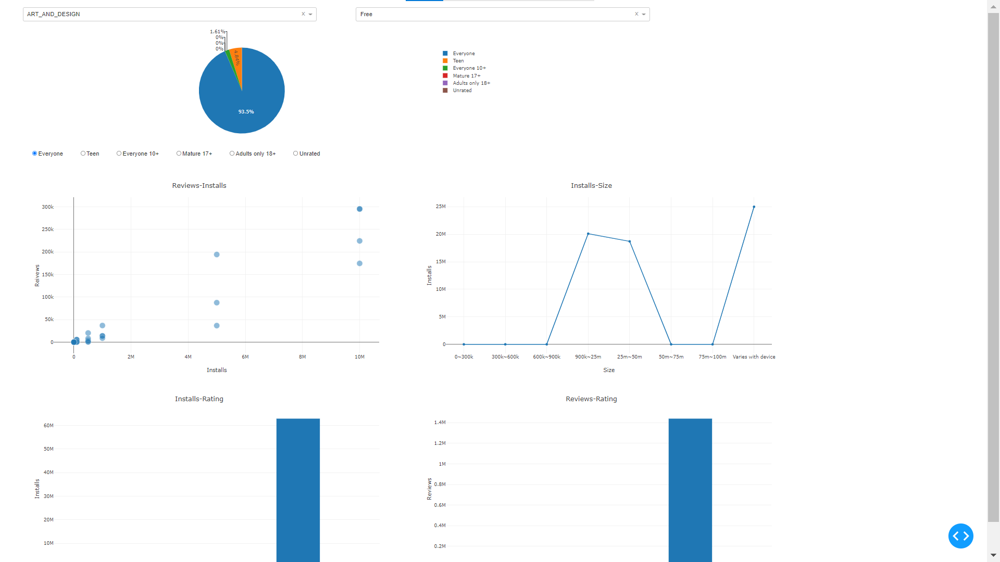
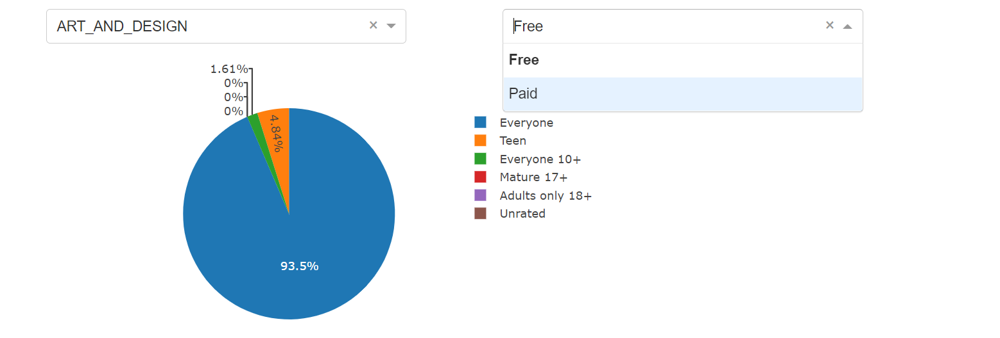
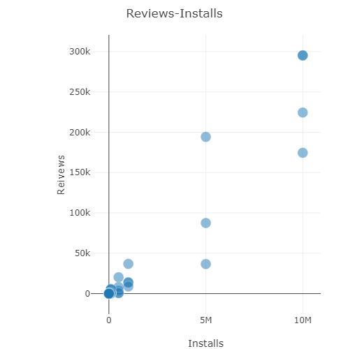
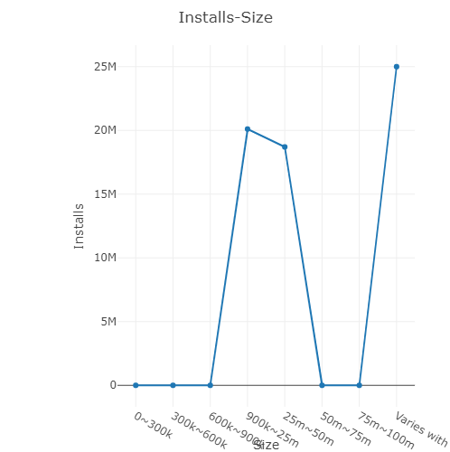
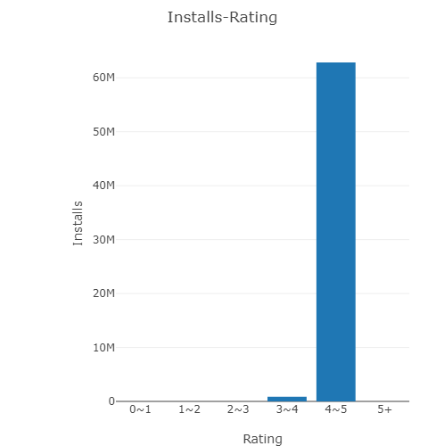
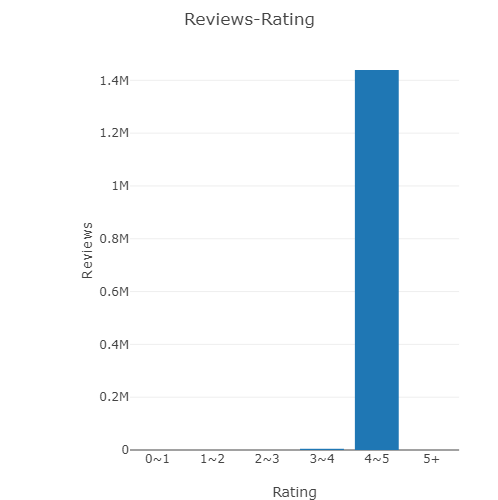

# Lab 3: Data Visualization

* 学号：1851049
* 姓名：陈中悦


[TOC]

## 项目简介

一个简单的基于 `google-play-store-apps`数据集的Dashboard.


## 功能介绍

1. 选择特定的App `Category`
2. 选择特定的App `Type`，包括：`Paid`或者`Free`
3. 选择特定的`Content Rating`，包括：`Teen`, `Everyone 10+`, `Mature 17+`, `Adults only 18+`, `Unrated`
4. 查看特定`Category`和`Type`下各`Content Rating`的App数量占比饼状图
5. 查看特定`Category`，`Type`和`Content Rating`的App的评论数(Reviews)和安装数(Installs)的散点图关系
6. 查看特定`Category`，`Type`和`Content Rating`的App的安装数(Installs)和大小(Size)的折线图关系
7. 查看特定`Category`，`Type`和`Content Rating`的App的安装数(Installs)和等级(Rating)的柱状图关系，以及评论数(Reviews)和等级(Rating)的柱状图关系


## 开发环境

* **PyCharm** *2020.1.3  PC-201.8538.36*


## 项目结构

```
│  lab3-dashboard_example.py
│  README.md
│
├─display
│      installs-rating.png
│      installs-size.png
│      layout.png
│      reviews-installs.png
│      reviews-rating.png
│
└─lab3-datasets
    └─google-play-store-apps
            googleplaystore.csv
```


## 运行方式

1. run `lab3-dashboard_example.py`

   ```python
   python lab3-dashboard_example.py
   ```

2. Once the server starts up, access http://localhost:8050/ to get the UI.

   

## 截屏示例

### 总览




### Content Rating 饼状图



### Reviews-Installs 散点图




### Installs-Size 折线图




### Installs-Rating 柱状图




### Reviews-Rating 柱状图

