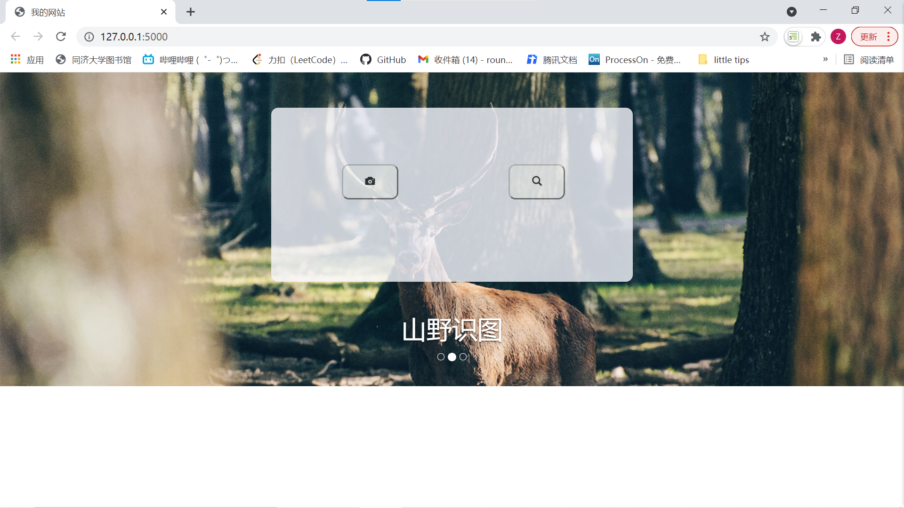
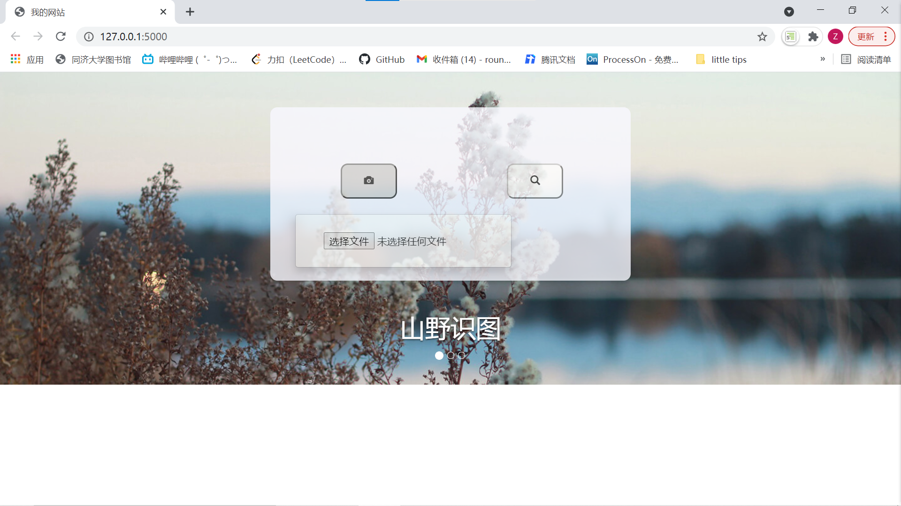
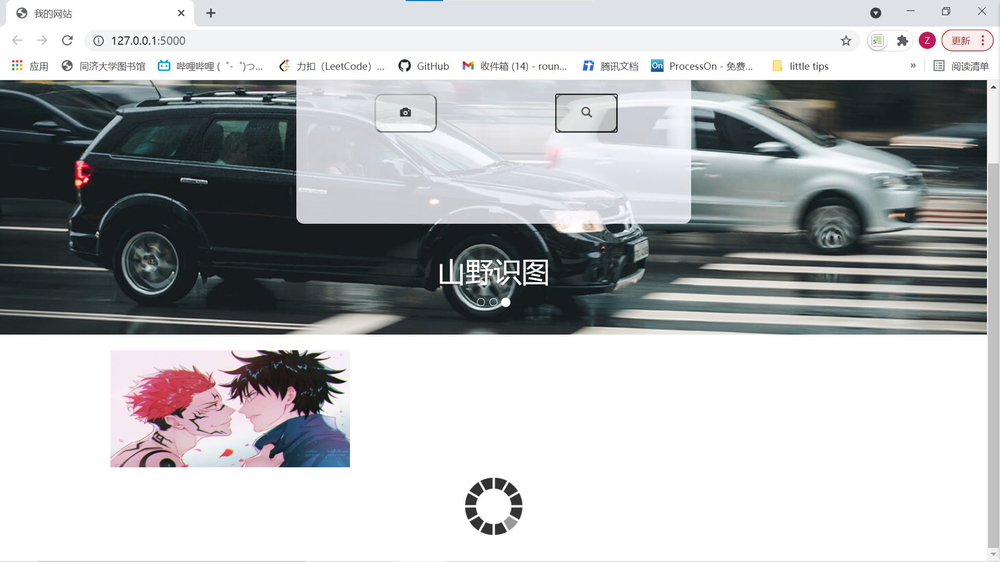
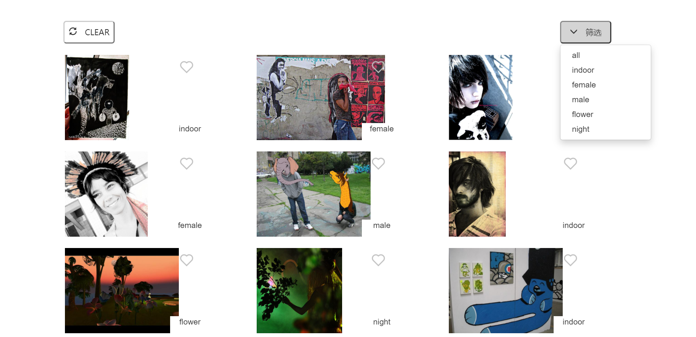
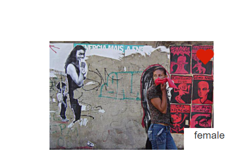
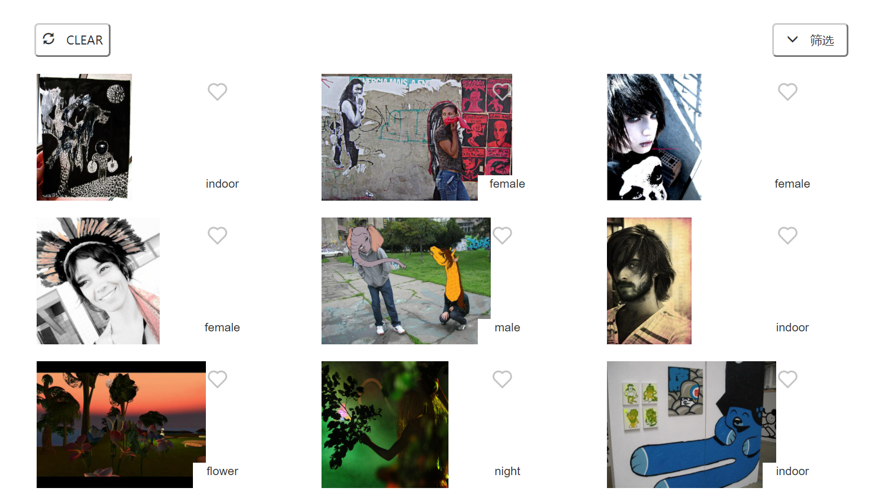

# Lab 2: Image similarity search using deep learning


## 项目简介

一个图像检索系统。


## 功能介绍

1. **上传**本地图片；

   *支持上传图片的预览。*

2. 点击 **搜索** 按钮进行相似图片搜索；

3. **显示 **搜索结果图片，以及各自的标签；

4. 根据标签**筛选**搜索结果图片；

5. **收藏**搜索结果图片；

6. 页面**重置**。


## 开发环境

* **PyCharm** *2020.1.3  PC-201.8538.36*
* **Visual Studio Code** *1.56.2*


## 项目结构

```
├─database
│  ├─dataset
│  └─tags
├─imagenet
├─static
│  ├─images
│  ├─lib
│  │  ├─css
│  │  ├─fonts
│  │  ├─img
│  │  └─js
│  └─result
├─templates
├─uploads
```


## 运行方式

* cd `server`，run `rest-server-demo.py`

  ```python
  python rest-server-demo.py
  ```

* Once the server starts up, access <http://localhost:5000/> to get the UI.  


## 截屏示例

### 主页



### 上传图片



### 图像搜索



### 图片筛选



### 图片收藏



### 页面重置

> 点击`CLEAR`, 回到主页




## 作者

* 学号：1851049

* 姓名：陈中悦

  